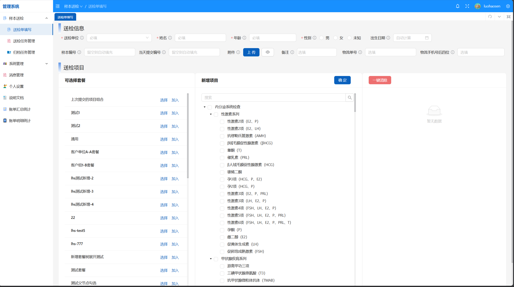

[中文版本](./README.md)

<h1 align="center">
   
  
</h1>

<h4 align="center">Clinical Test Program Information Management Platform</h4>

  <a href="https://CIP.org">HonePage</a> •
  <a href="https://demo.CIP.org">Demo</a> •
  <a href="https://github.com/CIP/CIP/discussions">Discussion</a> •
  <a href="https://docs.CIP.org">Document</a> 

  <!-- <a href="https://github.com/CIP/CIP/releases">Download</a> • -->

## :sparkles: Features

- :test_tube: Sample information management: complete input and management of submitted sample information, supports
  real-time tracking of sample status, historical record query and related file management, ensuring the standardization
  of the inspection process
- :bar_chart: Testing project management: Comprehensively manage the status and result data of sample testing projects,
  support project collaboration with cooperative units, and achieve standardized management of the testing process
- :hospital: Project database management: Uniformly manage all detectable projects and cooperative projects with other
  units, establish a complete project database, and support rapid retrieval of project information
- :moneybag: The bill statistics system: intelligently tallies the bill details of the submitted inspection items and
  provides visual display, supporting multi-dimensional cost analysis and financial statement viewing
- :package: Package delivery management: flexible configuration of testing project packages, efficient management of
  cooperative relationships with delivery units, and optimization of testing resource allocation and cost control
- :busts_in_silhouette: The user permission system: with complete user registration, login and password retrieval
  functions, supports user information management, permission allocation and user group division, ensuring system
  security
- :bell: The message notification center: real-time message push and notification management system, promptly conveys
  important information, enhancing team collaboration efficiency and work response speed
- :lock: Data security guarantee: multi-level data security protection mechanism, ensures the security, integrity and
  privacy protection of clinical laboratory data, in line with medical industry standards
- :globe_with_meridians: The website management panel: supports personalized configuration of site Settings and the
  title text of the login page, as well as the functions of registration or login

## :hammer_and_wrench: Deploy & Build

you can refer to [Deploy](.../docs/deploy/) for setup and build.

## :eyes: Demo

[Demo Access](https://demo.CIP.org)

default Account/Password：admin/12345678

## :alembic: Stacks

- **BackEnd
  **：  [JDK17](https://www.oracle.com/java/technologies/javase/jdk17-archive-downloads.html) + [Spring Boot 3](https://docs.springframework.org.cn/spring-framework/reference/spring-projects.html) + [Redis](https://redis.io/) + [MySQL](https://www.mysql.com/)
- **FrontEnd
  **：  [Vue](https://cn.vuejs.org/) + [Typescript](https://www.tslang.cn/) + [Vben-Admin](https://doc.vvbin.cn/guide/introduction.html) + [Ant-Design-Vue](https://www.antdv.com/docs/vue/introduce-cn)

## :raising_hand: Contributing

we welcome community contribution! Please follow the following steps:

1. Fork project
2. Create a feature branch (`git checkout -b feature/AmazingFeature`)
3. Submit changes (`git commit -m 'Add some AmazingFeature'`)
4. Push to the branch (`git push origin feature/AmazingFeature`)
5. Create Pull Request

## :triangular_ruler: Development specification

- Follow the coding standards
- Write unit tests
- Update relevant documents
- Ensure that the code passes the test

## :scroll: License

GPL V3

## :loudspeaker: Contact Us

If you have questions or suggestions, please contact us through the following methods:

- Submit An Issue
- [Click to Contact](http://192.168.2.202:5666/contact.html)
