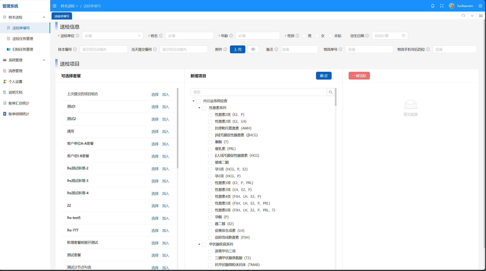

[English Version](./README-en.md)

<h1 align="center">
   
  
</h1>

<h4 align="center">临床检验信息管理系统</h4>

  <a href="https://CIP.org">主页</a> •
  <a href="https://demo.CIP.org">演示</a> •
  <a href="https://github.com/CIP/CIP/discussions">讨论</a> •
  <a href="https://docs.CIP.org">文档</a> 

<!-- <a href="https://github.com/CIP/CIP/releases">下载</a> • -->

## :sparkles: 特性

- :test_tube: 样本信息管理，完整的送检样本信息录入与管理，支持样本状态实时跟踪、历史记录查询和相关文件管理，确保检验流程规范化
- :bar_chart: 检测项目管理，全面管理样本检测项目的状态和结果数据，支持与合作单位的项目协作，实现检测流程的标准化管理
- :hospital: 项目库管理，统一管理所有可检测项目及与其他单位的合作项目，建立完善的项目数据库，支持项目信息的快速检索
- :moneybag: 账单统计系统，智能统计送检项目的账单明细并提供可视化展示，支持多维度的费用分析和财务报表查看
- :package: 套餐外送管理，灵活配置检测项目套餐，高效管理外送单位合作关系，优化检测资源配置和成本控制
- :busts_in_silhouette: ​用户权限体系，完善的用户注册、登录、密码找回功能，支持用户信息管理、权限分配和用户组划分，确保系统安全
- :bell: 消息通知中心，实时消息推送和通知管理系统，及时传达重要信息，提升团队协作效率和工作响应速度
- :lock: 数据安全保障，多层次的数据安全防护机制，确保临床检验数据的安全性、完整性和隐私保护，符合医疗行业标准
- :globe_with_meridians: 网站管理面板，支持个性化配置站点设置和登录页面的标题文本、注册或登录的功能

## :hammer_and_wrench: 启动和部署

你可以参考 [启动和部署](https://cip.oriseq.com/docs/getting-started.html) 进行启动和部署。

## :eyes: 演示

[演示地址](https://demo.CIP.org)

默认账号密码：admin/12345678

## :alembic: 技术栈

- **后端**： [JDK17](https://www.oracle.com/java/technologies/javase/jdk17-archive-downloads.html) + [Spring Boot 3](https://docs.springframework.org.cn/spring-framework/reference/spring-projects.html) + [Redis](https://redis.io/) + [MySQL](https://www.mysql.com/)
- **前端**： [Vue](https://cn.vuejs.org/) + [Typescript](https://www.tslang.cn/) + [Vben-Admin](https://doc.vvbin.cn/guide/introduction.html) + [Ant-Design-Vue](https://www.antdv.com/docs/vue/introduce-cn)

## :raising_hand: 代码贡献

我们欢迎社区贡献！请遵循以下步骤：

1. Fork 本项目
2. 创建特性分支 (`git checkout -b feature/AmazingFeature`)
3. 提交更改 (`git commit -m 'Add some AmazingFeature'`)
4. 推送到分支 (`git push origin feature/AmazingFeature`)
5. 创建 Pull Request

## :triangular_ruler: 开发规范

- 遵循编码规范
- 编写单元测试
- 更新相关文档
- 确保代码通过测试

## :scroll: 许可证

GPL V3

## :loudspeaker: 联系方式

如有问题或建议，请通过以下方式联系：

- 提交 Issue
- [联系我们](http://192.168.2.202:5666/contact.html)
